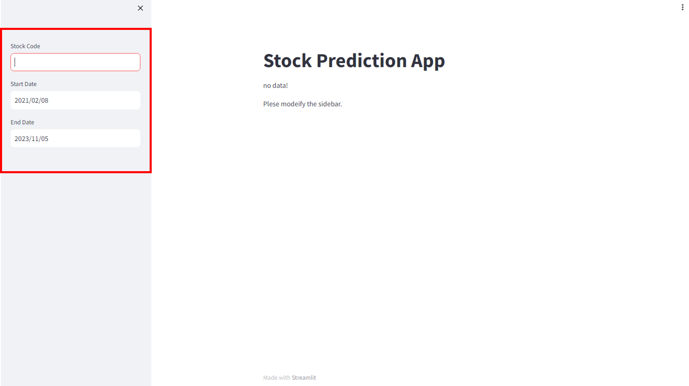
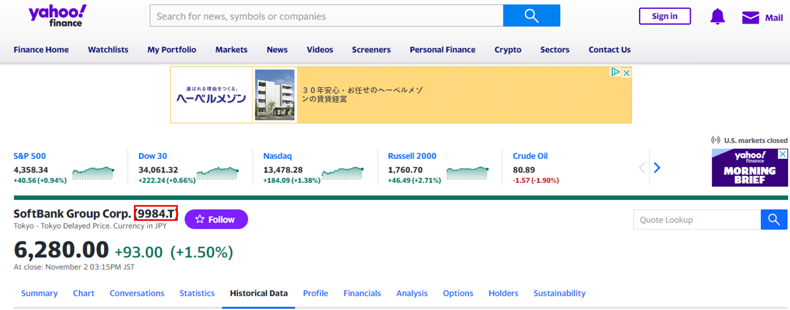
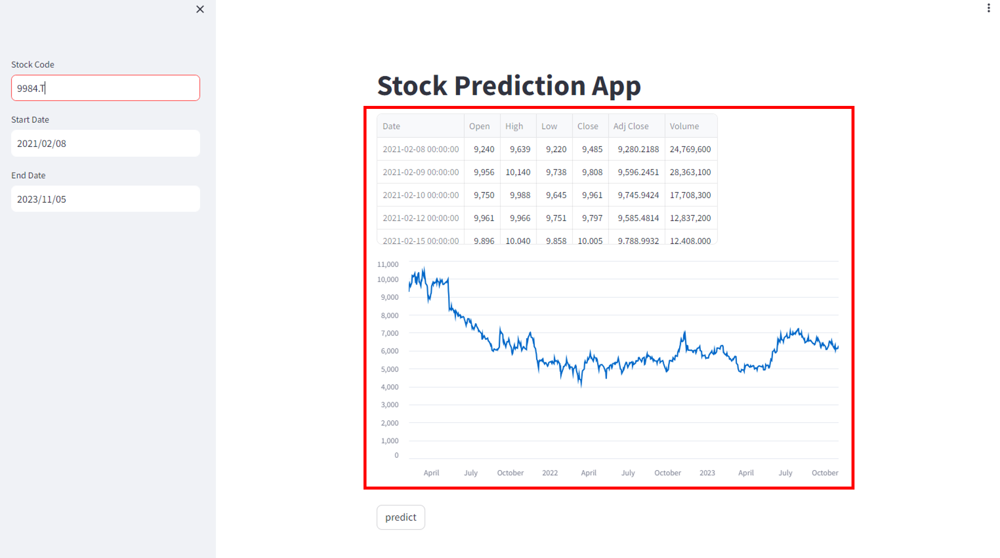
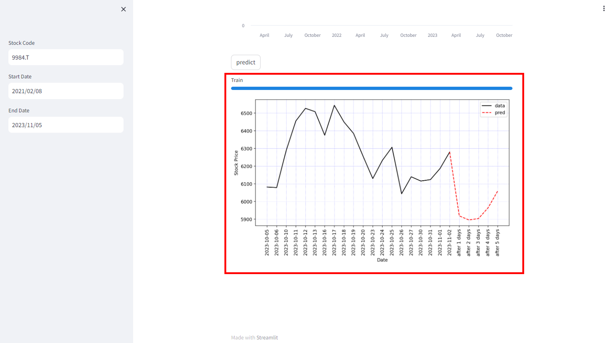

# Stock prediction by transformer
## Launch
The created application can be used by starting it on a Docker container or by installing the library in the local environment.

Download：
```
git clone 
cd ./Transformer_for_StockPrediction
```
### Docker
Build and run from dockerfile.
```bash
docker build -t stock_pred .
docker run -p 8501:8501 stock_pred
```
After executing the above command, access ```http:localhost:8501```.
### Local
Execute the following only when running in a virtual environment.
```bash
python venv venv
source ./source venv/bin/activate
```
Install the necessary libraries and start Streamlit.
After startup, a URL will be displayed on the console, so access this URL.
```bash
pip install -r requirement.txt
streamlit run main.py
```
## Usage
### Overview
By using the created model, you can predict stock prices.Stock price information is searched based on the stock and period conditions specified on the application, and the Transformer model is retrained based on the results.

The weights of the initial Transformer model are the result of training using stock prices of stocks listed on the TSE Prime Market up to the present (November 3, 2023).
The list of stocks specifically used is as follows: ```./data/Stock_List.csv```.
### Set the Parameter
You need to enter the stock code, stock price acquisition start date, and acquisition end date.



Stock codes are obtained from [Yahoo Finance](https://finance.yahoo.com/).



Once the input is complete, stock prices are obtained and displayed in tables and graphs.



### Predict
Once the parameters have been entered, a predict button will appear below the graph, so click on it. When you press the button, learning is performed again based on the data displayed at the top of the screen, and the final results are displayed in a graph.
The portions indicated by dotted lines are predicted values.
